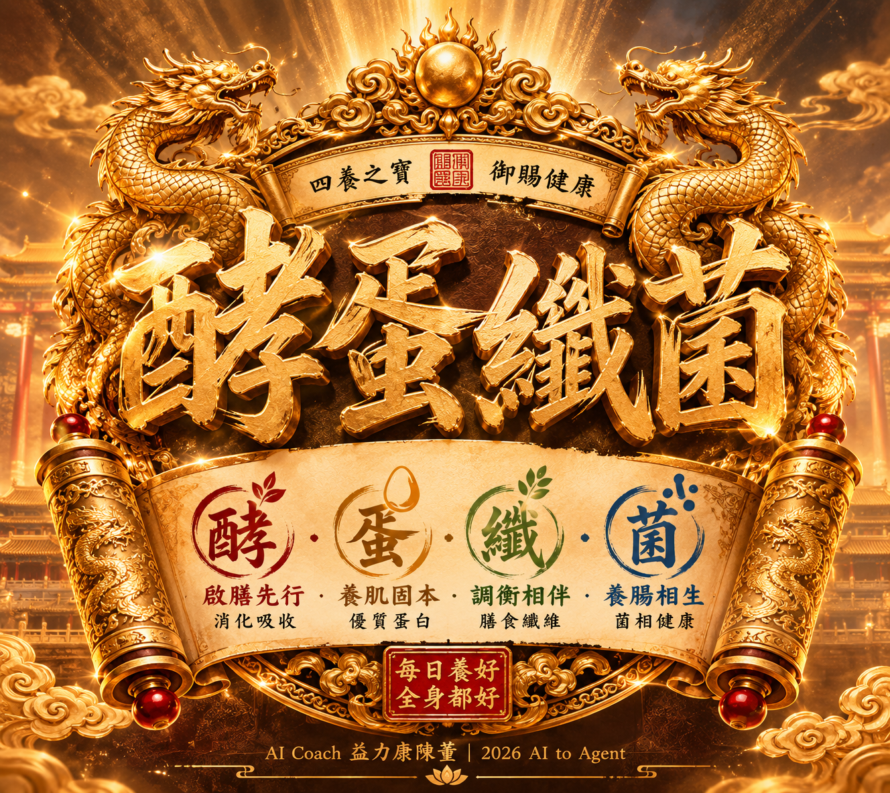
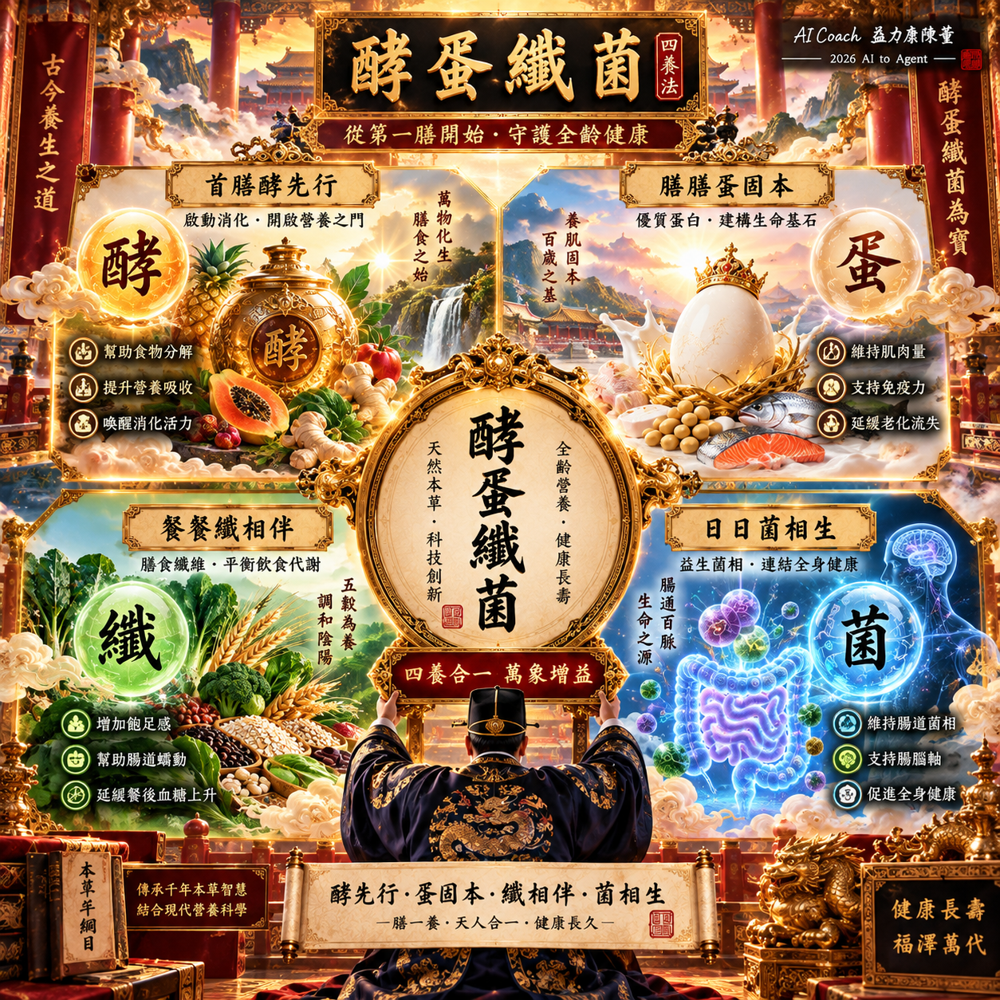
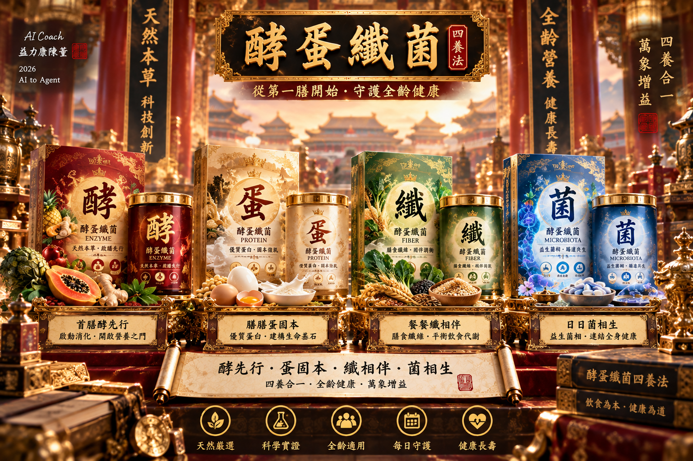

# 酵蛋纖菌™ IP
## CGM Coach Four-Pillar Nutrition Framework

**酵蛋纖菌™** 是由 **CGM Coach 血糖教練**建立的「每日營養四柱」健康管理框架，將複雜的營養知識收斂成容易理解、記憶與實踐的核心概念：

> **酵・蛋・纖・菌**  
> **Enzyme · Protein · Fiber · Probiotics**

核心是建立可以落實到每日飲食的營養管理語言。本專案記錄品牌方法論與設計資產，不代表整套框架已經臨床驗證。

*以上為 AI 生成品牌概念圖；圖中文字屬原始設計，標準用語以本 README 為準。*

## 四養膳法

| 四柱 | 核心口訣 | 營養定位 |
|---|---|---|
| **酵 Enzyme** | **首膳酵先行** | 建立第一膳的營養管理概念 |
| **蛋 Protein** | **膳膳蛋固本** | 重視每日優質蛋白質攝取 |
| **纖 Fiber** | **餐餐纖相伴** | 建立富含膳食纖維的飲食結構 |
| **菌 Probiotics** | **日日菌相生** | 關注益生菌、腸道菌相與微生態 |

## 一句話記住

> **首膳酵先行，膳膳蛋固本；**  
> **餐餐纖相伴，日日菌相生。**

十二字口訣：**酵先行・蛋固本・纖相伴・菌相生**。

「首膳酵先行」是品牌記憶語，不構成人人需要在第一餐補充酵素的建議；本框架不設定統一產品劑量或服用順序。

## Framework Architecture

| 層級 | 名稱 | 內容 |
|---|---|---|
| A | Lifestyle／生活管理 | 飲食 × 運動 × 睡眠 × 壓力 |
| A+ | Four-Pillar Nutrition／營養管理 | 酵 × 蛋 × 纖 × 菌 |
| S | Smart Data／數據回饋 | CGM × 穿戴裝置 × 身體組成 × AI |

> **生活管理 → 營養管理 → 數據回饋 → 持續優化**

四柱是營養溝通框架，不是完整營養素清單。數據與 AI 用於記錄、整理與回饋，不自動構成診斷或治療建議。

## 視覺資產

### 四象限視覺

### 產品包裝

三張圖保留原始檔案，呈現宮廷金紅、御藏珍寶與四柱色彩的創作方向。圖中產品、標示與效益文字均為概念素材，並非上市包裝、核准標示或功效證據。舊圖中的 **Microbiota** 指菌相，不能直接等同本版品牌四柱中的 **Probiotics**；後續重製依本版文字規範統一。詳見[視覺規範](docs/brand-guide.md)。

## IP Positioning

「酵蛋纖菌」是一套持續發展的**營養健康 IP 與知識框架**，可延伸至衛教內容、營養產品、知識圖卡、課程、健康數據應用與 AI Agent。

| 項目 | 定案 |
|---|---|
| Repository | `cgm-coach-4pillar-nutrition-ip` |
| 中文 IP | 酵蛋纖菌™ |
| 中文方法論 | 四養膳法 |
| 英文方法論 | Four-Pillar Nutrition Framework |
| Four Pillars | Enzyme × Protein × Fiber × Probiotics |
| 版本 | 1.0.0 |

既有商標準備文件使用「酵蛋纖菌四養法」，保留為歷史申請候選名稱；不表示「四養膳法」已完成檢索或申請。

## 文件導覽

- [框架與應用](docs/framework.md)
- [品牌文字與視覺規範](docs/brand-guide.md)
- [參考資料與查核狀態](docs/references.md)
- [商標準備原始 Word 文件](docs/trademark/trademark-application-v1.0-original.docx)
- [原始文件勘誤與待辦](docs/trademark/ERRATA.md)
- [GitHub 上傳說明](docs/github-upload.md)
- [素材來源與雜湊](assets/manifest.json)
- [權利與使用說明](RIGHTS.md)
- [版本紀錄](CHANGELOG.md)

## 使用與權利

本專案供品牌展示與文件管理，**未授予開源授權**。商業使用、改作、再散布及品牌授權請先取得相關權利人同意；AI 生成資產的權利範圍須另行確認。公開展示不等於商標註冊、產品許可或醫療實證。

「™」是品牌識別表達，不代表已取得註冊商標。商標文件為前置草案，正式送件內容與健康效益表述需另行確認。

> **把複雜營養學，變成每天記得住、做得到的四件事。**

**CGM Coach 血糖教練 × AI Coach 益力康陳董**  
**2026 AI to Agent**
